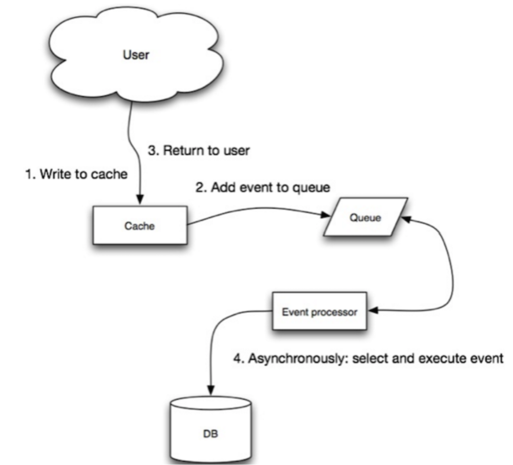

# RedisExample

#### 课程介绍
目标是提供一个高效、可靠的学习和实践Redis的环境。我们将通过搭建Redis集群、实现缓存数据的持久化存储、制定缓存数据的淘汰策略以及同步缓存数据等步骤来深入了解和学习Redis的特性和功能。通过这个项目，你可以掌握Redis的核心概念和技术，并能够熟练地将其应用到实际的开发工作中。无论你是初学者还是有一定经验的开发者，都可以从这个项目中获得收获和成长。欢迎加入我们的行列，一起学习Redis！
#### 1.Redis介绍
Redis 是一个开源（BSD 许可）的，内存中的数据结构存储系统，它可以用作数据库、缓存和消息中间件。
 它支持多种类型的数据结构，如 字符串（strings）， 散列（hashes）， 列表（lists）， 集合（sets）， 有序集合（sorted sets） 与范围查询， bitmaps， hyperloglogs 和 地理空间（geospatial） 索引半径查询。
 Redis 内置了 复制（replication），LUA 脚本（Lua scripting）， LRU 驱动事件（LRU eviction），事务（transactions） 和不同级别的 磁盘持久化（persistence）， 并通过 Redis 哨兵（Sentinel）和自动 分区（Cluster）提供高可用性（high availability）。
#### 2.Redis 安装

- Windows 下安装

下载地址：https://github.com/tporadowski/redis/releases。


双击 redis-server.exe


- Linux 源码安装

下载地址：http://redis.io/download，下载最新稳定版本。


本教程使用的最新文档版本为 2.8.17，下载并安装：
```
# wget http://download.redis.io/releases/redis-6.0.8.tar.gz
# tar -xzvf redis-6.0.8.tar.gz
# cd redis-6.0.8
# make
```
执行完 make 命令后，redis-6.0.8 的 src 目录下会出现编译后的 redis 服务程序 redis-server，还有用于测试的客户端程序 redis-cli：

下面启动 redis 服务：
```
# cd src
# ./redis-server
```
注意这种方式启动 redis 使用的是默认配置。也可以通过启动参数告诉 redis 使用指定配置文件使用下面命令启动。
```
# cd src
# ./redis-server ../redis.conf
```
redis.conf 是一个默认的配置文件。我们可以根据需要使用自己的配置文件。

启动 redis 服务进程后，就可以使用测试客户端程序 redis-cli 和 redis 服务交互了。 比如：
```
# cd src
# ./redis-cli
redis> set foo bar
OK
redis> get foo
"bar"
```
Ubuntu apt 命令安装
在 Ubuntu 系统安装 Redis 可以使用以下命令:
```
# sudo apt update
# sudo apt install redis-server
启动 Redis
# redis-server
查看 redis 是否启动？
# redis-cli
以上命令将打开以下终端：

redis 127.0.0.1:6379>
127.0.0.1 是本机 IP ，6379 是 redis 服务端口。现在我们输入 PING 命令。

redis 127.0.0.1:6379> ping
PONG
```
#### 3. Redis的数据结构
Redis支持以下五种数据结构：

- String（字符串）：最简单的类型，可以理解为与Memcached一模一样的类型，一个key对应一个value。
- List（列表）：由若干个字符串元素组成的集合，每个字符串元素都是按照插入顺序排序的。
- Set（集合）：由不重复且无序的字符串元素组成的。
- Hash（散列）：可以存储多个键值对之间的映射，键的类型必须为字符串，而值的类型既可以是字符串也可以是数字，但是值必须是唯一的，不可重复。
- Sorted Sets（有序集合）：和散列类似，主要区别是有序集合是按照值进行自动排序的。

#### 4. Redis缓存特性
- 速度快，读写性能 10W/s，当然了和机器配置也有关系为什么快呢？内存操作，C语言实现，离操作系统API更近；单线程架构（务必不要记错），避免了多线程竞争带来的损耗。IO多路复用，协议简单。
- 支持持久化，虽然是交互时是内存操作，但提供数据落盘机制，防止断电产生的数据丢失问题。
- 支持主从复制：多副本 Master-Slave 节点
- 支持高可用 HA：哨兵（sentinel）机制实现高可用，保证节点故障自动发现和故障转移
- 支持多客户端语言：Java、Python、C++等。

#### 5. Redis使用场景
- 缓存：数据库之前加缓存，降低数据库读写压力
- 排行榜：按照热度排名、按照发布时间排名
- 计数器：播放数、浏览数
- 社交网络：赞、踩、粉丝、下拉刷新
- 消息队列：发布订阅

#### 6. Redis客户端-Jedis

Jedis String(字符串) 实例
```
import redis.clients.jedis.Jedis;
 
public class RedisStringJava {
    public static void main(String[] args) {
        //连接本地的 Redis 服务
        Jedis jedis = new Jedis("localhost");
        System.out.println("连接成功");
        //设置 redis 字符串数据
        jedis.set("name", "test");
        // 获取存储的数据并输出
        System.out.println("redis 存储的字符串为: "+ jedis.get("name"));
    }
}
```
####  7. Jedis Pipeline
Jedis的pipeline实现基于Redis的协议规范，可以将多个命令发送到Redis服务器，并且无需等待每个命令的回复，而是在所有命令都发送完毕后，一次性获取所有的回复。

具体实现上，Jedis将多个命令放入一个列表中，然后通过pipeline.sync()或pipeline.close()将所有命令一次性发送到Redis服务器。在服务器端，所有的命令会被依次执行，并记录每个命令的执行结果。当所有的命令都执行完毕后，Jedis会一次性获取所有的执行结果，并返回给客户端。

因此，Jedis pipeline的实现原理可以总结为：将多个命令打包成一个请求，发送到服务器，然后在服务器端依次执行这些命令，并记录每个命令的执行结果。最后，将所有的执行结果打包成一个响应，返回给客户端。

使用Jedis pipeline可以提高效率，因为它可以减少客户端和服务器之间的网络通信开销，特别是在需要执行大量的读写操作时。同时，pipeline模式还可以保证事务的原子性，适用于需要执行一系列读写操作的业务场景。

Jedis的pipeline主要有以下特点：

1. 线程安全：Jedis的pipeline是基于连接池的，因此它是线程安全的，可以在多个线程之间共享和并发使用同一个pipeline。
2. 批量处理：pipeline模式可以将多个命令一次性发送到服务器，减少了网络通信的开销。特别是当需要执行大量的读写操作时，pipeline模式可以显著提高性能。
3. 事务处理：pipeline模式支持事务，可以在多个命令组成的管道中实现原子性操作。如果中间任何一个命令失败，整个管道都会回滚，不会执行失败命令之后的命令。
4. 连接管理：使用pipeline模式时，多个命令被缓存到本地，然后一次性发送到服务器，而不是每执行一个命令就向服务器发送请求，这可以减少客户端与服务器之间的交互次数。

Jedis的pipeline支持所有基本的Redis命令，包括但不限于以下类型：
好的，以下是Markdown格式的表格内容：

- 字符串命令：例如SET, GET, MSET, MGET等。
- 哈希表命令：例如HSET, HGET, HMSET, HMGET等。
- 列表命令：例如LPUSH, RPUSH, LPOP, RPOP等。
- 集合命令：例如SADD, SMEMBERS等。
- 有序集合命令：例如ZADD, ZRANGE等。
- 数据库命令：例如SELECT, MOVE, DEL等。
- 事务命令：例如MULTI, EXEC, DISCARD等。
- Lua脚本命令：例如EVAL, EVALSHA等。
请注意，不是所有的命令都支持pipeline方式执行，比如一些需要多个步骤才能完成的操作，像SUBSCRIBE、PSUBSCRIBE、PUBLISH等命令就不支持pipeline方式执行。对于这些不支持pipeline的命令，你只能一个个单独发送并等待响应。更多细节可以参考Jedis的官方文档或源码。

####  8. Redis缓存策略


Cache Aside、Read Through、Write Through 和 Write Back 的步骤过程如下：

1. Cache Aside：

- 读取数据时，先查询缓存，如果命中缓存，则直接返回数据。
- 如果未命中缓存，则查询数据库，并将查询结果放入缓存。
- 更新数据时，先删除缓存中的数据，再更新数据库中的数据。
2. Read Through：

- 读取数据时，先查询缓存，如果命中缓存，则直接返回数据。
- 如果未命中缓存，则查询数据库，并将查询结果放入缓存。
- 更新数据时，先查询数据库，将要更新的数据放入缓存中，并更新数据库中的数据。
3. Write Through：

- 读取数据时，先查询缓存，如果命中缓存，则直接返回数据。
- 如果未命中缓存，则查询数据库，并将查询结果放入缓存。
- 更新数据时，先查询数据库，将要更新的数据放入缓存中，并更新数据库中的数据。
4. Write Back：

- 读取数据时，先查询缓存，如果命中缓存，则直接返回数据。
- 如果未命中缓存，则查询数据库，并将查询结果放入缓存。
- 更新数据时，只更新缓存，将缓存中的数据标记为脏数据（需要同步到数据库的数据），并不立即同步到数据库中。


Cache Aside、Read Through、Write Through 和 Write Back 都是缓存策略，它们有各自的优缺点和使用场景。

1. Cache Aside 策略：
- 优点：

实现简单，易于理解和实现。

不需要使用缓存服务代理，对业务代码无侵入。
- 缺点：

需要自己维护数据更新后的逻辑，对业务代码有侵入。

在更新数据时，需要先查询缓存，再查询数据库，增加了查询的开销。
- 使用场景：适用于轻量级应用，对数据一致性要求不高的场景。

2. Read Through 策略：
- 优点：

实现了缓存和数据库的同步，避免了脏读和重复查询的问题。

减少了数据库的负载压力，提高了查询效率。
- 缺点：

需要使用缓存服务代理，对业务代码有侵入。

在高并发的情况下，可能会出现竞争问题，需要使用锁或者其他同步机制来保证数据的一致性。
- 使用场景：适合需要频繁使用缓存的应用，例如电商网站、新闻网站等。

3. Write Through 策略：
- 优点：

在更新数据时，缓存服务代理会先更新缓存，再更新数据库，减少了更新时的开销。

保证了数据的一致性和完整性，减少了数据不一致的问题。
- 缺点：

需要使用缓存服务代理，对业务代码有侵入。

在高并发的情况下，可能会出现竞争问题，需要使用锁或者其他同步机制来保证数据的一致性。
- 使用场景：适合对数据一致性要求较高的场景，例如银行系统、交易系统等。

4. Write Back 策略：
- 优点：

在更新数据时，只更新缓存，然后异步更新数据库，提高了性能。

在写入数据时，不会立即同步到数据库中，减少了同步的开销。
- 缺点：

如果缓存宕机或者应用程序崩溃，可能会导致数据丢失。

在高并发的情况下，可能会出现竞争问题，需要使用锁或者其他同步机制来保证数据的一致性。
- 使用场景：适合对数据一致性要求不高的场景，例如电商网站、新闻网站等。在使用时需要注意缓存的容量限制和更新频率问题。

#### Redis最佳实践
##### 1.优雅的key结构
Redis的Key虽然可以自定义，但最好遵循下面的几个最佳实践约定：

遵循基本格式：[业务名称]:[数据名]:[id]
长度不超过44字节
不包含特殊字符
例如：我们的登录业务，保存用户信息，其key可以设计成如下格式：


这样设计的好处：

可读性强
避免key冲突
方便管理
更节省内存： key是string类型，底层编码包含int、embstr和raw三种。embstr在小于44字节使用，
采用连续内存空间，内存占用更小。当字节数大于44字节时，会转为raw模式存储，在raw模式下，
内存空间不是连续的，而是采用一个指针指向了另外一段内存空间，在这段空间里存储SDS内容，
这样空间不连续，访问的时候性能也就会收到影响，还有可能产生内存碎片

##### 2.拒绝BigKey
BigKey通常以Key的大小和Key中成员的数量来综合判定，例如：

Key本身的数据量过大：一个String类型的Key，它的值为5 MB
Key中的成员数过多：一个ZSET类型的Key，它的成员数量为10,000个
Key中成员的数据量过大：一个Hash类型的Key，它的成员数量虽然只有1,000个但这些成员的Value（值）总大小为100 MB
那么如何判断元素的大小呢？redis也给我们提供了命令
推荐值：

单个key的value小于10KB
对于集合类型的key，建议元素数量小于1000
###### 2.1 BigKey的危害
网络阻塞：对BigKey执行读请求时，少量的QPS就可能导致带宽使用率被占满，导致Redis实例，乃至所在物理机变慢
内存倾斜：BigKey所在的Redis实例内存使用率远超其他实例，无法使数据分片的内存资源达到均衡
Redis阻塞：对元素较多的hash、list、zset等做运算会耗时较旧，使主线程被阻塞
CPU压力：对BigKey的数据序列化和反序列化会导致CPU的使用率飙升，影响Redis实例和本机其它应用
###### 2.2 如何发现BigKey
1、redis-cli --bigkeys
利用redis-cli提供的–bigkeys参数，可以遍历分析所有key，并返回Key的整体统计信息与每个数据的Top1的big key

2、scan 扫描
自己编程，利用scan扫描Redis中的所有key，利用strlen、hlen等命令判断key的长度

scan 命令调用完后每次会返回2个元素，第一个是下一次迭代的光标（第一次光标会设置为0，当最后一次scan 返回的光标等于0时，表示整个scan遍历结束了），第二个返回的是List，一个匹配的key的数组

3、第三方工具
利用第三方工具，如 Redis-Rdb-Tools 分析RDB快照文件，全面分析内存使用情况
https://github.com/sripathikrishnan/redis-rdb-tools

###### 2.3 如何删除BigKey
BigKey内存占用较多，即便时删除这样的key也需要耗费很长时间，导致Redis主线程阻塞，引发一系列问题

redis 3.0 及以下版本 如果是集合类型，则遍历BigKey的元素，先逐个删除子元素，最后删除BigKey
Redis 4.0以后
Redis在4.0后提供了异步删除的命令：unlink

##### 3. 选择恰当的数据类型
例1：比如存储一个User对象，我们有三种存储方式：
①方式一：json字符串

user:1	{“name”: “Jack”, “age”: 21}
优点：实现简单粗暴
缺点：数据耦合，不够灵活

②方式二：字段打散

user:1:name	Jack
user:1:age	21
优点：可以灵活访问对象任意字段
缺点：占用空间大、没办法做统一控制

③方式三：hash（推荐）

user:1	name	jack
age	21
优点：底层使用ziplist，空间占用小，可以灵活访问对象的任意字段
缺点：代码相对复杂

例2：假如有hash类型的key，其中有100万对field和value，field是自增id，这个key存在什么问题？如何优化？
存在的问题：

hash的entry数量超过500时，会使用哈希表而不是ZipList，内存占用较多

可以通过hash-max-ziplist-entries配置entry上限。但是如果entry过多就会导致BigKey问题
①方案一
拆分为string类型

key	value
id:0	value0
.....	.....
id:999999	value999999
存在的问题：

string结构底层没有太多内存优化，内存占用较多
想要批量获取这些数据比较麻烦

②方案二
拆分为小的hash，将 id / 100 作为key， 将id % 100 作为field，这样每100个元素为一个Hash
key	field	value
key:0	id:00	value0
.....	.....
id:99	value99
key:1	id:00	value100
.....	.....
id:99	value199
....
key:9999	id:00	value999900
.....	.....
id:99	value999999


##### 4. 批处理优化
1、Pipeline
1.1 客户端与redis服务器的交互过程
单个命令的执行流程

N条命令的执行流程

redis处理指令是很快的，主要花费的时候在于网络传输。于是乎很容易想到将多条指令批量的传输给redis


1.2 批量操作命令
Redis提供了很多Mxxx这样的命令，可以实现批量插入数据，例如：mset、hmset；
但是对于像 list、set、zset相关的数据结构没有对应的批处理命令

利用mset批量插入10万条数据
```
@Test
void testMxx() {
    String[] arr = new String[2000];
    int j;
    long b = System.currentTimeMillis();
    for (int i = 1; i <= 100000; i++) {
        j = (i % 1000) << 1;  //左移一位，相当于乘以2
        arr[j] = "test:key_" + i;
        arr[j + 1] = "value_" + i;
        if (j == 0) {
            jedis.mset(arr);
        }
    }
    long e = System.currentTimeMillis();
    System.out.println("time: " + (e - b));
}
```
1.3 批量操作命令Pipeline
MSET虽然可以批处理，但是却只能操作部分数据类型，因此如果有对复杂数据类型的批处理需要，建议使用Pipeline
```
@Test
void testPipeline() {
    // 创建管道
    Pipeline pipeline = jedis.pipelined();
    long b = System.currentTimeMillis();
    for (int i = 1; i <= 100000; i++) {
        // 放入命令到管道
        pipeline.set("test:key_" + i, "value_" + i);
        if (i % 1000 == 0) {
            // 每放入1000条命令，批量执行
            pipeline.sync();
        }
    }
    long e = System.currentTimeMillis();
    System.out.println("time: " + (e - b));
}
```
2、集群下的批处理
如MSET或Pipeline这样的批处理需要在一次请求中携带多条命令，而此时如果Redis是一个集群，那批处理命令的多个key必须落在一个插槽中，否则就会导致执行失败。


这个时候，我们可以找到4种解决方案


##### 5.服务器端优化 - 持久化配置
用来做缓存的Redis实例尽量不要开启持久化功能
建议关闭RDB持久化功能（RDB容易），使用AOF持久化
设置合理的rewrite阈值，避免频繁的bgrewrite
配置no-appendfsync-on-rewrite = yes，禁止在rewrite期间做aof，避免因AOF引起的阻塞
部署有关建议：

Redis实例的物理机要预留足够内存，应对fork和rewrite
单个Redis实例内存上限不要太大，例如4G或8G。可以加快fork的速度、减少主从同步、数据迁移压力
不要与CPU密集型应用部署在一起
不要与高硬盘负载应用一起部署。例如：数据库、消息队列
##### 6.服务器端优化 - 慢查询优化
1、什么是慢查询
并不是很慢的查询才是慢查询，而是：在Redis执行时耗时超过某个阈值的命令，称为慢查询

慢查询的危害：由于Redis是单线程的，所以当客户端发出指令后，他们都会进入到redis底层的queue来执行，如果此时有一些慢查询的数据，就会导致大量请求阻塞，从而引起报错，所以我们需要解决慢查询问题。


慢查询的阈值可以通过配置指定：
slowlog-log-slower-than：慢查询阈值，单位是微秒。默认是10000，建议1000（1毫秒）

慢查询会被放入慢查询日志中，日志的长度有上限，可以通过配置指定：
slowlog-max-len：慢查询日志（本质是一个队列）的长度。默认是128，建议1000

修改这两个配置可以使用：config set命令：


2、如何查看慢查询
知道了以上内容之后，那么咱们如何去查看慢查询日志列表呢：

slowlog len：查询慢查询日志长度
slowlog get [n]：读取n条慢查询日志
slowlog reset：清空慢查询列表

##### 7.服务器端优化-命令及安全配置
Redis会绑定在0.0.0.0:6379，这样将会将Redis服务暴露到公网上，而Redis如果没有做身份认证，会出现严重的安全漏洞
漏洞重现方式：https://cloud.tencent.com/developer/article/1039000

漏洞出现的核心的原因有以下几点：

Redis未设置密码
利用了Redis的config set命令动态修改Redis配置
使用了Root账号权限启动Redis
所以：如何解决呢？我们可以采用如下几种方案
为了避免这样的漏洞，这里给出一些建议：

Redis一定要设置密码
禁止线上使用下面命令：keys、flushall、flushdb、config set等命令。可以利用rename-command禁用。
bind：限制网卡，禁止外网网卡访问
开启防火墙
不要使用Root账户启动Redis
尽量不是有默认的端口
##### 8.Redis内存划分和内存配置
当Redis内存不足时，可能导致Key频繁被删除、响应时间变长、QPS不稳定等问题。当内存使用率达到90%以上时就需要我们警惕，并快速定位到内存占用的原因。

有关碎片问题分析
Redis底层分配并不是这个key有多大，他就会分配多大，而是有他自己的分配策略，比如8,16,20等等，假定当前key只需要10个字节，此时分配8肯定不够，那么他就会分配16个字节，多出来的6个字节就不能被使用，这就是我们常说的 碎片问题

##### 9.服务器端集群优化-集群还是主从
集群虽然具备高可用特性，能实现自动故障恢复，但是如果使用不当，也会存在一些问题：

集群完整性问题
集群带宽问题
数据倾斜问题
客户端性能问题
命令的集群兼容性问题
lua和事务问题
###### 问题1、在Redis的默认配置中，如果发现任意一个插槽不可用，则整个集群都会停止对外服务：
大家可以设想一下，如果有几个slot不能使用，那么此时整个集群都不能用了，我们在开发中，其实最重要的是可用性，所以需要把如下配置修改成no，即有slot不能使用时，我们的redis集群还是可以对外提供服务


###### 问题2、集群带宽问题

集群节点之间会不断的互相Ping来确定集群中其它节点的状态。每次Ping携带的信息至少包括：

插槽信息
集群状态信息
集群中节点越多，集群状态信息数据量也越大，10个节点的相关信息可能达到1kb，此时每次集群互通需要的带宽会非常高，这样会导致集群中大量的带宽都会被ping信息所占用，这是一个非常可怕的问题，所以我们需要去解决这样的问题

解决途径：

避免大集群，集群节点数不要太多，最好少于1000，如果业务庞大，则建立多个集群。
避免在单个物理机中运行太多Redis实例
配置合适的cluster-node-timeout值
###### 问题3 命令的集群兼容性问题

有关这个问题咱们已经探讨过了，当我们使用批处理的命令时，redis要求我们的key必须落在相同的slot上，然后大量的key同时操作时，是无法完成的，所以客户端必须要对这样的数据进行处理，这些方案我们之前已经探讨过了，所以不再这个地方赘述了。

###### 问题4 lua和事务的问题

lua和事务都是要保证原子性问题，如果你的key不在一个节点，那么是无法保证lua的执行和事务的特性的，所以在集群模式是没有办法执行lua和事务的

###### 问题5 那我们到底是集群还是主从
单体Redis（主从Redis）已经能达到万级别的QPS，并且也具备很强的高可用特性。如果主从能满足业务需求的情况下，所以如果不是在万不得已的情况下，尽量不搭建Redis集群

#### 学习资料
- Redis官网:http://redis.io/
- Redis官方文档:http://redis.io/documentation
- Redis教程:https://www.runoob.com/redis/redis-tutorial.html
- Redis下载:http://redis.io/download
- redis英文文档 https://redis.io/topics/data-types
- redis中文文档 http://www.redis.cn/documentation.
- 博客 https://blog.csdn.net/h356363/category_8930846.html

#### QA 相关问题

##### http, socket ,tcp的区别
HTTP、Socket和TCP是网络通信中常用的协议和技术，它们各自扮演着不同的角色。

- HTTP协议：HTTP是Hypertext Transfer Protocol（超文本传输协议）的简称，它是互联网上应用最为广泛的一种网络协议。HTTP协议用于浏览器和服务器之间的通信，它规定了浏览器如何向服务器发送请求以及服务器如何将响应返回给浏览器。HTTP协议是基于应用层的协议，它提供了一种具体的方式来传输和接收数据。
- Socket：Socket是对TCP/IP协议的封装和应用，它是支持TCP/IP协议的网络通信的基本操作单元。在网络通信过程中，Socket用于端点的抽象表示，它包含了进行网络通信所必需的五种信息：连接使用的协议、本地主机的IP地址、本地进程的协议端口、远地主机的IP地址和远地进程的协议端口。程序员使用Socket进行网络通信时，需要对TCP/IP协议进行操作，Socket则提供了一个TCP的接口。可以说，Socket是对TCP/IP协议的应用层封装。
- TCP协议：TCP（Transmission Control Protocol，传输控制协议）是一种面向连接的、可靠的、基于字节流的传输层通信协议。它通过在发送方和接收方之间建立虚连接，提供了一种可靠的数据传输服务，能够确保数据在传输过程中的正确性和可靠性。TCP协议对应于传输层，它在网络通信过程中负责数据的传输和控制，它可以确保数据在传输过程中不丢失、不重复、不错乱。

总结来说，HTTP协议、Socket和TCP协议各自有不同的特点和作用。HTTP协议用于规定浏览器和服务器之间的通信规则；Socket是对TCP/IP协议的应用层封装，用于网络通信的基本操作；TCP协议则负责数据的传输和控制，确保数据在传输过程中的可靠性和正确性。


#### 更多学习资料 请关注微信公众号


