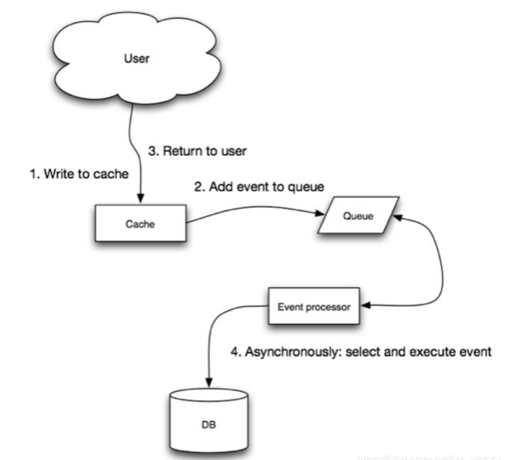

# RedisExample

#### 课程介绍
目标是提供一个高效、可靠的学习和实践Redis的环境。我们将通过搭建Redis集群、实现缓存数据的持久化存储、制定缓存数据的淘汰策略以及同步缓存数据等步骤来深入了解和学习Redis的特性和功能。通过这个项目，你可以掌握Redis的核心概念和技术，并能够熟练地将其应用到实际的开发工作中。无论你是初学者还是有一定经验的开发者，都可以从这个项目中获得收获和成长。欢迎加入我们的行列，一起学习Redis！
#### 1.Redis介绍
Redis 是一个开源（BSD 许可）的，内存中的数据结构存储系统，它可以用作数据库、缓存和消息中间件。
 它支持多种类型的数据结构，如 字符串（strings）， 散列（hashes）， 列表（lists）， 集合（sets）， 有序集合（sorted sets） 与范围查询， bitmaps， hyperloglogs 和 地理空间（geospatial） 索引半径查询。
 Redis 内置了 复制（replication），LUA 脚本（Lua scripting）， LRU 驱动事件（LRU eviction），事务（transactions） 和不同级别的 磁盘持久化（persistence）， 并通过 Redis 哨兵（Sentinel）和自动 分区（Cluster）提供高可用性（high availability）。
#### 2.Redis 安装

- Windows 下安装

下载地址：https://github.com/tporadowski/redis/releases。


双击 redis-server.exe


- Linux 源码安装

下载地址：http://redis.io/download，下载最新稳定版本。


本教程使用的最新文档版本为 2.8.17，下载并安装：
```
# wget http://download.redis.io/releases/redis-6.0.8.tar.gz
# tar -xzvf redis-6.0.8.tar.gz
# cd redis-6.0.8
# make
```
执行完 make 命令后，redis-6.0.8 的 src 目录下会出现编译后的 redis 服务程序 redis-server，还有用于测试的客户端程序 redis-cli：

下面启动 redis 服务：
```
# cd src
# ./redis-server
```
注意这种方式启动 redis 使用的是默认配置。也可以通过启动参数告诉 redis 使用指定配置文件使用下面命令启动。
```
# cd src
# ./redis-server ../redis.conf
```
redis.conf 是一个默认的配置文件。我们可以根据需要使用自己的配置文件。

启动 redis 服务进程后，就可以使用测试客户端程序 redis-cli 和 redis 服务交互了。 比如：
```
# cd src
# ./redis-cli
redis> set foo bar
OK
redis> get foo
"bar"
```
Ubuntu apt 命令安装
在 Ubuntu 系统安装 Redis 可以使用以下命令:
```
# sudo apt update
# sudo apt install redis-server
启动 Redis
# redis-server
查看 redis 是否启动？
# redis-cli
以上命令将打开以下终端：

redis 127.0.0.1:6379>
127.0.0.1 是本机 IP ，6379 是 redis 服务端口。现在我们输入 PING 命令。

redis 127.0.0.1:6379> ping
PONG
```
#### 3. Redis的数据结构
Redis支持以下五种数据结构：

- String（字符串）：最简单的类型，可以理解为与Memcached一模一样的类型，一个key对应一个value。
- List（列表）：由若干个字符串元素组成的集合，每个字符串元素都是按照插入顺序排序的。
- Set（集合）：由不重复且无序的字符串元素组成的。
- Hash（散列）：可以存储多个键值对之间的映射，键的类型必须为字符串，而值的类型既可以是字符串也可以是数字，但是值必须是唯一的，不可重复。
- Sorted Sets（有序集合）：和散列类似，主要区别是有序集合是按照值进行自动排序的。

#### 4. Redis缓存特性
- 速度快，读写性能 10W/s，当然了和机器配置也有关系为什么快呢？内存操作，C语言实现，离操作系统API更近；单线程架构（务必不要记错），避免了多线程竞争带来的损耗。IO多路复用，协议简单。
- 支持持久化，虽然是交互时是内存操作，但提供数据落盘机制，防止断电产生的数据丢失问题。
- 支持主从复制：多副本 Master-Slave 节点
- 支持高可用 HA：哨兵（sentinel）机制实现高可用，保证节点故障自动发现和故障转移
- 支持多客户端语言：Java、Python、C++等。

#### 5. Redis使用场景
- 缓存：数据库之前加缓存，降低数据库读写压力
- 排行榜：按照热度排名、按照发布时间排名
- 计数器：播放数、浏览数
- 社交网络：赞、踩、粉丝、下拉刷新
- 消息队列：发布订阅

#### 6. Redis客户端-Jedis

Jedis String(字符串) 实例
```
import redis.clients.jedis.Jedis;
 
public class RedisStringJava {
    public static void main(String[] args) {
        //连接本地的 Redis 服务
        Jedis jedis = new Jedis("localhost");
        System.out.println("连接成功");
        //设置 redis 字符串数据
        jedis.set("name", "test");
        // 获取存储的数据并输出
        System.out.println("redis 存储的字符串为: "+ jedis.get("name"));
    }
}
```
####  7. Jedis Pipeline
Jedis的pipeline实现基于Redis的协议规范，可以将多个命令发送到Redis服务器，并且无需等待每个命令的回复，而是在所有命令都发送完毕后，一次性获取所有的回复。

具体实现上，Jedis将多个命令放入一个列表中，然后通过pipeline.sync()或pipeline.close()将所有命令一次性发送到Redis服务器。在服务器端，所有的命令会被依次执行，并记录每个命令的执行结果。当所有的命令都执行完毕后，Jedis会一次性获取所有的执行结果，并返回给客户端。

因此，Jedis pipeline的实现原理可以总结为：将多个命令打包成一个请求，发送到服务器，然后在服务器端依次执行这些命令，并记录每个命令的执行结果。最后，将所有的执行结果打包成一个响应，返回给客户端。

使用Jedis pipeline可以提高效率，因为它可以减少客户端和服务器之间的网络通信开销，特别是在需要执行大量的读写操作时。同时，pipeline模式还可以保证事务的原子性，适用于需要执行一系列读写操作的业务场景。

Jedis的pipeline主要有以下特点：

1. 线程安全：Jedis的pipeline是基于连接池的，因此它是线程安全的，可以在多个线程之间共享和并发使用同一个pipeline。
2. 批量处理：pipeline模式可以将多个命令一次性发送到服务器，减少了网络通信的开销。特别是当需要执行大量的读写操作时，pipeline模式可以显著提高性能。
3. 事务处理：pipeline模式支持事务，可以在多个命令组成的管道中实现原子性操作。如果中间任何一个命令失败，整个管道都会回滚，不会执行失败命令之后的命令。
4. 连接管理：使用pipeline模式时，多个命令被缓存到本地，然后一次性发送到服务器，而不是每执行一个命令就向服务器发送请求，这可以减少客户端与服务器之间的交互次数。

Jedis的pipeline支持所有基本的Redis命令，包括但不限于以下类型：
好的，以下是Markdown格式的表格内容：

- 字符串命令：例如SET, GET, MSET, MGET等。
- 哈希表命令：例如HSET, HGET, HMSET, HMGET等。
- 列表命令：例如LPUSH, RPUSH, LPOP, RPOP等。
- 集合命令：例如SADD, SMEMBERS等。
- 有序集合命令：例如ZADD, ZRANGE等。
- 数据库命令：例如SELECT, MOVE, DEL等。
- 事务命令：例如MULTI, EXEC, DISCARD等。
- Lua脚本命令：例如EVAL, EVALSHA等。
请注意，不是所有的命令都支持pipeline方式执行，比如一些需要多个步骤才能完成的操作，像SUBSCRIBE、PSUBSCRIBE、PUBLISH等命令就不支持pipeline方式执行。对于这些不支持pipeline的命令，你只能一个个单独发送并等待响应。更多细节可以参考Jedis的官方文档或源码。

####  8. Redis缓存策略


Cache Aside、Read Through、Write Through 和 Write Back 的步骤过程如下：

1. Cache Aside：

- 读取数据时，先查询缓存，如果命中缓存，则直接返回数据。
- 如果未命中缓存，则查询数据库，并将查询结果放入缓存。
- 更新数据时，先删除缓存中的数据，再更新数据库中的数据。
2. Read Through：

- 读取数据时，先查询缓存，如果命中缓存，则直接返回数据。
- 如果未命中缓存，则查询数据库，并将查询结果放入缓存。
- 更新数据时，先查询数据库，将要更新的数据放入缓存中，并更新数据库中的数据。
3. Write Through：

- 读取数据时，先查询缓存，如果命中缓存，则直接返回数据。
- 如果未命中缓存，则查询数据库，并将查询结果放入缓存。
- 更新数据时，先查询数据库，将要更新的数据放入缓存中，并更新数据库中的数据。
4. Write Back：

- 读取数据时，先查询缓存，如果命中缓存，则直接返回数据。
- 如果未命中缓存，则查询数据库，并将查询结果放入缓存。
- 更新数据时，只更新缓存，将缓存中的数据标记为脏数据（需要同步到数据库的数据），并不立即同步到数据库中。


Cache Aside、Read Through、Write Through 和 Write Back 都是缓存策略，它们有各自的优缺点和使用场景。

1. Cache Aside 策略：
- 优点：

实现简单，易于理解和实现。

不需要使用缓存服务代理，对业务代码无侵入。
- 缺点：

需要自己维护数据更新后的逻辑，对业务代码有侵入。

在更新数据时，需要先查询缓存，再查询数据库，增加了查询的开销。
- 使用场景：适用于轻量级应用，对数据一致性要求不高的场景。

2. Read Through 策略：
- 优点：

实现了缓存和数据库的同步，避免了脏读和重复查询的问题。

减少了数据库的负载压力，提高了查询效率。
- 缺点：

需要使用缓存服务代理，对业务代码有侵入。

在高并发的情况下，可能会出现竞争问题，需要使用锁或者其他同步机制来保证数据的一致性。
- 使用场景：适合需要频繁使用缓存的应用，例如电商网站、新闻网站等。

3. Write Through 策略：
- 优点：

在更新数据时，缓存服务代理会先更新缓存，再更新数据库，减少了更新时的开销。

保证了数据的一致性和完整性，减少了数据不一致的问题。
- 缺点：

需要使用缓存服务代理，对业务代码有侵入。

在高并发的情况下，可能会出现竞争问题，需要使用锁或者其他同步机制来保证数据的一致性。
- 使用场景：适合对数据一致性要求较高的场景，例如银行系统、交易系统等。

4. Write Back 策略：
- 优点：

在更新数据时，只更新缓存，然后异步更新数据库，提高了性能。

在写入数据时，不会立即同步到数据库中，减少了同步的开销。
- 缺点：

如果缓存宕机或者应用程序崩溃，可能会导致数据丢失。

在高并发的情况下，可能会出现竞争问题，需要使用锁或者其他同步机制来保证数据的一致性。
- 使用场景：适合对数据一致性要求不高的场景，例如电商网站、新闻网站等。在使用时需要注意缓存的容量限制和更新频率问题。

#### 学习资料
- Redis官网:http://redis.io/
- Redis官方文档:http://redis.io/documentation
- Redis教程:https://www.runoob.com/redis/redis-tutorial.html
- Redis下载:http://redis.io/download
- redis英文文档 https://redis.io/topics/data-types
- redis中文文档 http://www.redis.cn/documentation.
- 博客 https://blog.csdn.net/h356363/category_8930846.html

#### QA 相关问题

##### http, socket ,tcp的区别
HTTP、Socket和TCP是网络通信中常用的协议和技术，它们各自扮演着不同的角色。

- HTTP协议：HTTP是Hypertext Transfer Protocol（超文本传输协议）的简称，它是互联网上应用最为广泛的一种网络协议。HTTP协议用于浏览器和服务器之间的通信，它规定了浏览器如何向服务器发送请求以及服务器如何将响应返回给浏览器。HTTP协议是基于应用层的协议，它提供了一种具体的方式来传输和接收数据。
- Socket：Socket是对TCP/IP协议的封装和应用，它是支持TCP/IP协议的网络通信的基本操作单元。在网络通信过程中，Socket用于端点的抽象表示，它包含了进行网络通信所必需的五种信息：连接使用的协议、本地主机的IP地址、本地进程的协议端口、远地主机的IP地址和远地进程的协议端口。程序员使用Socket进行网络通信时，需要对TCP/IP协议进行操作，Socket则提供了一个TCP的接口。可以说，Socket是对TCP/IP协议的应用层封装。
- TCP协议：TCP（Transmission Control Protocol，传输控制协议）是一种面向连接的、可靠的、基于字节流的传输层通信协议。它通过在发送方和接收方之间建立虚连接，提供了一种可靠的数据传输服务，能够确保数据在传输过程中的正确性和可靠性。TCP协议对应于传输层，它在网络通信过程中负责数据的传输和控制，它可以确保数据在传输过程中不丢失、不重复、不错乱。

总结来说，HTTP协议、Socket和TCP协议各自有不同的特点和作用。HTTP协议用于规定浏览器和服务器之间的通信规则；Socket是对TCP/IP协议的应用层封装，用于网络通信的基本操作；TCP协议则负责数据的传输和控制，确保数据在传输过程中的可靠性和正确性。


